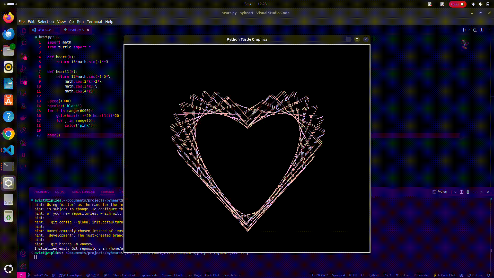

 
  

<h1 align="center"> PY-HEART </h1>

 
  

<!-- ABOUT THE PROJECT -->
<h2 id="about-the-project"> About The Project</h2>

 
  Well just a suprise for ur Valentine's nothing personal

<!-- OVERVIEW -->
<h2 id="overview">Overview</h2>

 
  In this project, I made a heart using Turtle and math libraries in Python

<!-- GETTING STARTED -->
<h2 id="getting-started">Getting Started</h2>

Clone the repository

<pre><code>$ git clone https://github.com/avict18/pyheart</code></pre>

change directory into the project folder

<pre><code>$ cd pyheart</code></pre>

Execute the script

<pre><code>$ python3 heart.py</code></pre>

!
<!-- CREDITS -->
<h2 id="credits">Credits</h2>

Aaron Victor

## Acknowledgements:

I would like to acknowledge some few friends for challenging me to do this:

- **Brown Mafuru** availiable on [**github**](https://github.com/nelacommunity)